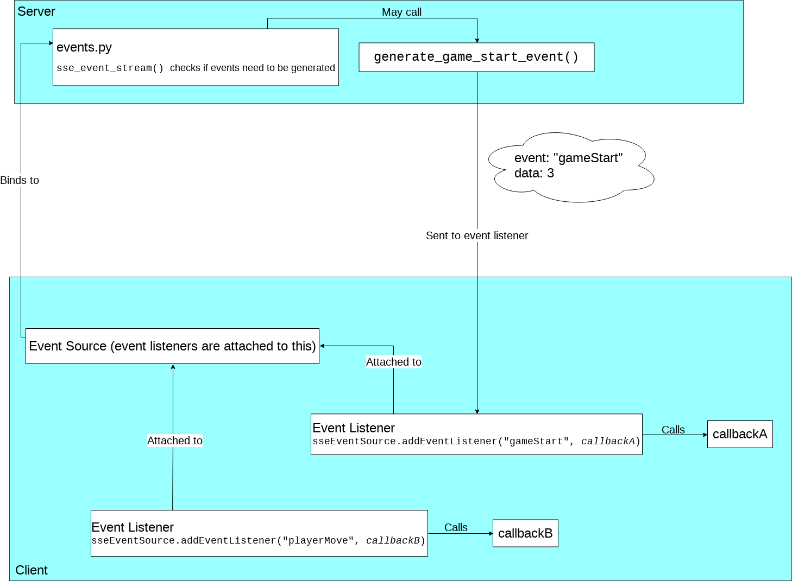

# About this Document

## Summary

This document provides details on how the frontend of the software works, and provides "How to" for writing code to work with certain components. It is designed to supplement (and not repeat) the contents of the [contributing document](../CONTRIBUTING.md) at the top-level of this project file hierarchy.

## Target Audience

This document is targeted towards developers interested in contributing to the frontend of this software project. See the [External Documentation](#external-documentation) section for links to documents relevant to other areas of this project (e.g. backend).

## Scope of this Document

This document will cover aspects of the software related to frontend only. For instance, how to write server-side event listeners in JavaScript.

## External Documentation:

If you are starting to contribute to this project for the first time, it is stongly recommended that you review the [contributing document](../CONTRIBUTING.md), which covers everything needed to write code for this project.

For developers interested in contributing to the project backend, see the [backend README](../backend/README.rst).

# Monopoly Frontend

## Table of Contents
* [Server-Sent Events](#server-sent-events)
  * [What They are](#what-they-are)
  * [How to Write an SSE Listener](#how-to-write-a-client-side-sse-listener)

## Server-Sent Events

### What They are
They're essentially a means for a server to send data to a client **without**
the client having to make any requests.

#### How it Works (from a brief implementation perspective)
1. The client makes an **event listener**, just like any ol' event listener
(click, mouseover, keypress, etc.).
2. The server sends the event (which has the **same name** as what the client
is listening for) to standard output along with data (which can be something
like a bit of JSON).
3. The client will receive this event and trigger the event callback.

#### Diagram


### How to Write a Client-Side SSE Listener
1. In your JavaScript code, add the following import statement:

   `import {getEventSource} from './sse';`

2. In your JavaScript code, get a reference to the event source:

   `const sseEventSourceReference = getEventSource();`

   **Note**: The event source is like a _path_ from the server to the
   client through which events will travel.

   **Also note**: The event source (which is a class, by the way) is
   initialised by waitingGame() already, therefore, there's no need to
   re-initialise it again, all you have to do is "get" the event source, as
   per the step above.

3. Now attach an event listener to the event source:

   e.g.

   `mySseEventSource.addEventListener("gameStart", myCallback)`

   **Note**: The event type will vary depending on the event type that will be
   sent by the server. In this example, the event type is "gameStart".
   Other types used in this project include "playerMove" and "playerJoin".

   If you created a server-side event generator in events.py, then you know
   what the event type is. If you're receiving events from someone else's
   server-side event generator, then find out what event type their code
   generates by looking up events.py (or just ask them in person :smiley:).

4. In your callback function, do whatever you want with the data that was
   send by the server.

   e.g.

   ```javascript
   mySseEventSource.addEventListener('gameStart', (myEventData) => {
       const theData = myEventData.data;
       // Do something with 'theData'
   });
   ```
   Note that in some cases the server will send "data" in **JSON format**
   (i.e. generate_player_join_event), therefore, you'll need to **parse**
   the event "data" in the client code.

   e.g.

   ```javascript
   mySseEventSource.addEventListener('...', (myEventData) => {
       const theData = JSON.parse(myEventData.data);
       // Do something with 'theData'
   });
   ```
